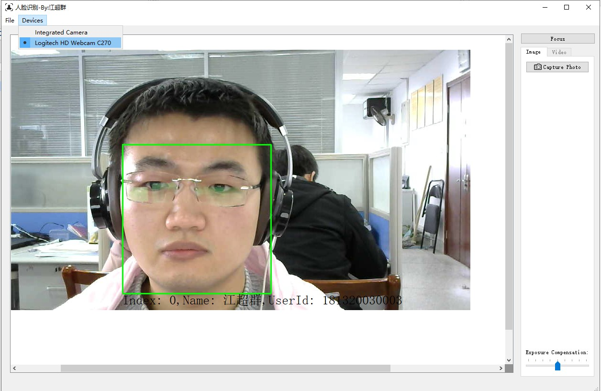
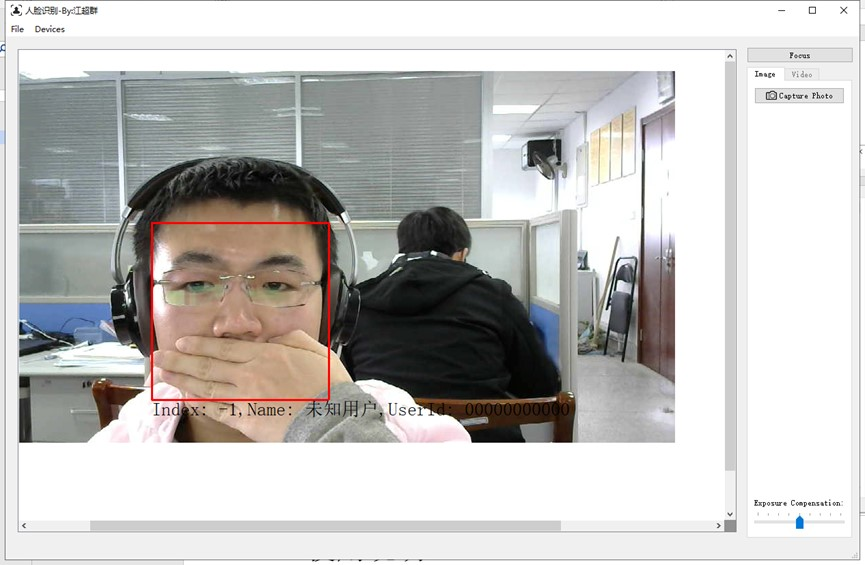

# Face identification
This is just a demo of face identification on windows 10 x64 using qt 5.

# Screenshots
The program will mark the Known people with green rectangle, and mark unknown people with red rectangle for warning meaning.




# How to compile
Step 1 :My scripts based on `Mingw 7.30 x64`, so the first thing you need to do is compile the dependnt libraries using your compile.
You need compile those libraries:

```
Dlib 19.17
opencv 3.4
flann 1.9.1
```

Step 2 :After you finish Step 1, you need to modify the include path and lib path, so you can link to the libraries when you compile the project. I pushed the config file at `libs.pri`. But I only talk about using it at **win32 and release** mode. If you want compile it on Ubuntu and other system, please reweite the `libs.pri` file.

Step 3: Compile it. And copy the `database/` floder to the dir of bin. And copy the model file using for face landmark and face recongition to the dir of bin.

> The dlib trained model download path: [shape_predictor_5_face_landmarks.dat.bz2](http://dlib.net/files/shape_predictor_5_face_landmarks.dat.bz2) [dlib_face_recognition_resnet_model_v1.dat.bz2](http://dlib.net/files/dlib_face_recognition_resnet_model_v1.dat.bz2)

> Unzip them, copy shape_predictor_5_face_landmarks.dat and dlib_face_recognition_resnet_model_v1.dat into the dir bin.

Step 4: Congratulations! Now, you can use it.

# Reference
1. [Dlib 19.17](http://dlib.net/)
2. [opencv 3.4.5](https://opencv.org/)
3. [Qt 5.12 Mingw 730 x64](https://www.qt.io/)
4. [qtcsv 1.5.0](https://github.com/iamantony/qtcsv)
5. [FLANN 1.9.1](https://github.com/mariusmuja/flann)
